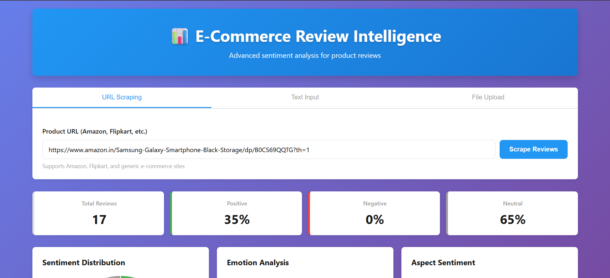
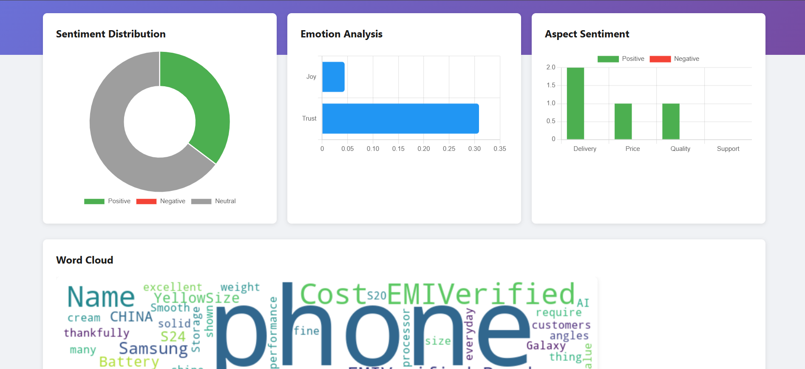

# AI Sentiment Analyzer using Flask 

AI Sentiment Analyzer is a web-based application built using **Flask** that analyzes the sentiment of text input or batch files. It uses Google's **Gemini AI** for advanced sentiment analysis to determine whether the sentiment is positive, negative, neutral, or mixed. The application also generates word clouds and includes a conversational chatbot feature.

## Live Demo
📱 **Website**: [AI Sentiment Analyser](https://ai-sentiment-analyser-using-flask.onrender.com/)

## Screenshots

### Application Interface


### Word Cloud Example


### Sentiment Result


## Features
- **Text Sentiment Analysis**: Analyze the sentiment of single text input with confidence scores
- **Batch Sentiment Analysis**: Upload CSV, TXT, or Excel files for batch processing (up to 100 entries)
- **Multiple File Formats**: Support for .csv, .txt, .xlsx, and .xls files
- **Word Cloud Generation**: Visualize the most frequent words in your text
- **Download Word Cloud**: Save generated word clouds as PNG files
- **Responsive Design**: Modern, mobile-friendly interface
- **Real-time Processing**: Instant results with progress indicators
- **Clean and Responsive UI**: Simple and modern interface to interact with the application.

## Technologies Used
- **Flask**: Web framework for the application backend
- **Google Gemini AI**: Advanced language model for sentiment analysis
- **Langchain**: Framework for LLM integration and prompt management
- **Python**: Core programming language
- **Pandas**: Data processing for batch analysis
- **Matplotlib & WordCloud**: Visualization libraries
- **Jinja2**: Templating engine for dynamic HTML rendering.
- **HTML5 and CSS3**: For front-end design and styling.
- **JavaScript**: Interactive frontend functionality

## Installation

### Prerequisites
- Python 3.11 or higher
- Google Gemini API key (get it from [Google AI Studio](https://makersuite.google.com/app/apikey))
- `pip` (Python package manager)

### Quick Start

1. **Clone the repository:**
   ```bash
   git clone https://github.com/Rajeshaligeti/AI_Sentiment_Analyser_using_Flask.git
   cd AI_Sentiment_Analyser_using_Flask
   ```

2. **Create a virtual environment:**
   
   **Windows:**
   ```bash
   python -m venv venv
   venv\Scripts\activate
   ```
   
   **macOS/Linux:**
   ```bash
   python3 -m venv venv
   source venv/bin/activate
   ```

3. **Install dependencies:**
   ```bash
   pip install -r requirements.txt
   ```

4. **Set up environment variables:**
   Create a `.env` file in the root directory and add your Google Gemini API key:
   ```
   GOOGLE_API_KEY=your_api_key_here
   ```

5. **Run the application:**
   ```bash
   python app.py
   ```

6. **Access the application:**
   Open your browser and visit: [http://127.0.0.1:5000/](http://127.0.0.1:5000/)

## Usage

1. **Text Sentiment Analysis**: Enter text in the input field and click analyze to get sentiment results with confidence scores
2. **Batch Analysis**: Upload a CSV, TXT, or XLSX file with multiple entries for bulk sentiment analysis
3. **Word Cloud**: Generate and download word clouds from your analyzed text
4. **Chat**: Use the conversational chatbot for interactive analysis

## Project Structure

```
├── app.py                     # Main Flask application
├── config.py                  # Configuration settings
├── requirements.txt           # Python dependencies
├── modules/
│   ├── llm_engine.py         # LLM integration logic
│   ├── sentiment_analyzer.py  # Sentiment analysis implementation
│   └── scraper.py            # Web scraping utilities
├── templates/                 # HTML templates
│   ├── index.html            # Main interface
│   └── dashboard.html        # Dashboard page
├── static/                    # CSS and JavaScript files
│   ├── styles.css
│   └── dashboard.css
└── media/                     # Screenshots and images
```

## Technologies Used

- **Flask**: Web framework for the application backend
- **Google Gemini AI**: Advanced language model for sentiment analysis
- **Langchain**: Framework for LLM integration and prompt management
- **Python**: Core programming language
- **Pandas**: Data processing for batch analysis
- **Matplotlib & WordCloud**: Visualization libraries
- **Jinja2**: Templating engine for dynamic HTML rendering
- **HTML5 & CSS3**: Front-end design and styling
- **JavaScript**: Interactive frontend functionality
This project is licensed under the [Apache License 2.0](LICENSE).  
Feel free to use, modify, and distribute the code as per the terms of the license.

